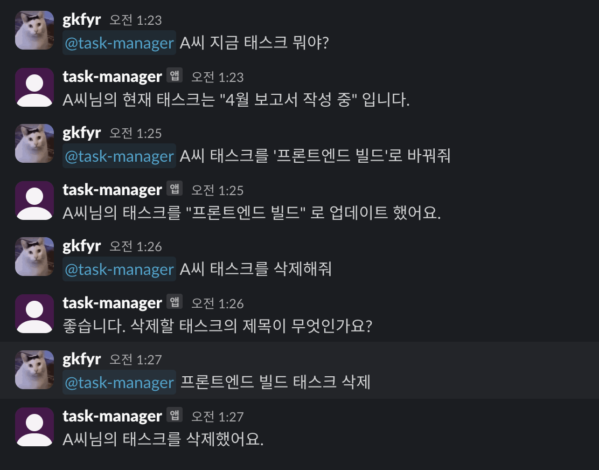

# Slack AI Prototype

Slack + GPT 기반의 간단한 업무 어시스턴트 프로토타입입니다.  
Slack 메시지로 업무 태스크를 관리하고, AI 를 통해 회의 시간 추천 및 자연어 질문에 응답합니다.

> ⚠️ 이 프로젝트는 프로토타입입니다.  
> 메모리 기반으로 동작하며, 서버를 재시작하면 데이터는 초기화됩니다.

## 기능

- ✅ 유저별 업무 태스크 조회
- ✅ 업무 태스크 추가 / 수정 / 삭제
- ✅ 팀 회의 시간 추천 (GPT 기반)
- ✅ 기타 자연어 질문에 대한 GPT 응답
- ✅ 봇 멘션 시에만 작동

### 사용 예시 (Slack 내에서)

## 주의사항

- 메모리 기반으로 동작합니다. 서버 재시작 시 데이터는 초기화됩니다.
- Slack 앱 및 OpenAI API 키가 필요합니다.
- 테스트용으로 사용하세요.
